### Importing necessary modules:


```python
# These Python modules are necessary for processing the data and also for visualisations.
import numpy as np
import pandas as pd
import seaborn as sns
import matplotlib.pyplot as plt
from NeuralNetwork import NN
import losses
```

### Study of Wake effect as described by the N. O. Jensen model:

#### N. O. Jensen Single Wake effect model:

##### Defining a Wind Turbine:


```python
class WindTurbine(object):
    def __init__(self, rotor_D, hub_h, Ct, alpha, x, y, V, hill_x = 0, hill_y = 0, H = 0, L = 1) -> None:
        self.rotor_D = rotor_D # Rotor diameter (m)
        self.hub_h = hub_h # Hub-height (m)

        # Position of Turbine in plane: (x +ve downstream)
        self.x = x
        self.y = y

        # The hill coordinates of the turbine:
        self.hl_x = hill_x
        self.hl_y = hill_y

        # The bell-coefficients for the hill:
        self.hl_H = H
        self.hl_L = L
        self.hill_coeff()

        # The ground-wind speed:
        self.wind = V

        # Initial undisturbed upstream wind experienced by Turbine blades
        self.V = self.wind*(1 + 4*self.hl_a*self.hl_s)

        self.Ct = Ct # Coefficient of thrust
        self.alpha = alpha # Linear wake expansion factor
        

    def hill_coeff(self):
        h = self.hl_H / (1 + ((self.hl_y-self.y)/self.hl_L)**2)
        if(h==0):
            self.hl_s = 0
            self.hl_a = 1
            return
        
        l = self.hl_L * self.hl_H / (h if h!=0 else 1)
        if(l==0):
            self.hl_s = 0
            self.hl_a = 1
            return


        self.hl_s = h / (2*l)
        self.hl_a = (1 - np.abs(self.hl_x - self.x)/(1.5*l))*(np.exp(-2.5*self.hub_h/l) if (self.hl_s<0.3) else np.exp(-1.5*self.hub_h/h))
        return

```

##### The N. O. Jensen Wake Deficit Model: (with Terrain Effect)


```python
def jensen_model_deficit(WT: WindTurbine, x_down, ):
    """
    N. O. Jensen model for wake velocity deficit

    Parameters: (vectorized)
    V0 : float
        Free stream wind speed (m/s)
    rotor_D : float
        Rotor diameter of the turbine (m)
    alpha: float
        Wake expansion factor
    x_down : float
        Distance downstream from the turbine (m)
    Ct : float
        Rotor thrust coefficient (m)

    Returns: (vectorized)
    float
        Wake velocity deficit at different distances behind the turbine (m/s)
    """
    V0, Ct, rotor_D, alpha, a, s, = WT.wind, WT.Ct, WT.rotor_D, WT.alpha, WT.hl_a, WT.hl_s

    rotor_r = rotor_D/2
    wake_r = rotor_r + alpha*x_down

    wake_deficit = np.where(wake_r>=rotor_r,V0*(1-np.sqrt(1-Ct))*np.power(rotor_r/wake_r,2),0) # If 'x_down' is negative 'Wake deficit' is not defined (0)

    # Lissaman model with terrain effect:
    wake_deficit = wake_deficit / (1 + 4*a*s)
    
    return wake_deficit
```

##### Testing the Single Wake model:


```python
# Parameters:

V = float(input("Free stream wind speed (m/s):")) # Free stream wind speed (m/s)
rotor_D = float(input("Enter rotor diameter(m):"))   # Rotor diameter of the turbine (m)

hub_h = int(input("Hub-height:")) # Hub height of the turbine
z0 = float(input("Surface roughness factor:"))   # Surface roughness coefficient
alpha = 1/(2*np.log(hub_h/z0))
alpha = 0.04 # Common value

Ct = float(input("Enter the thrust coefficient:")) # Thrust coefficient of turbine

# Defining the Wind Turbine
WT = WindTurbine(rotor_D, hub_h, Ct, alpha, 0, 0, V, 1,2,50,30)

WT1 = WindTurbine(rotor_D, hub_h, Ct, alpha, 0, 0, V)

# Distance range
x_range = np.linspace(0, 100 * WT.rotor_D, 100)

# Calculate the wake velocity deficit
vel_deficit = jensen_model_deficit(WT, x_range,)
vel_ = jensen_model_deficit(WT1,x_range)
wake_velocity = WT.V - vel_deficit

# Plot the wake velocity and deficit
# plt.plot(x_range, wake_velocity, label='Wind Velocity')
plt.plot(x_range, vel_deficit, label='Wake Velocity Deficit (with Terrain effect)')
plt.plot(x_range,vel_,label='Wake Velocity Deficit (without Terrain effect)')
plt.xlabel('Distance Downstream from Turbine (m)')
plt.ylabel('Velocity (m/s)')
plt.title('N. O. Jensen Model - Wake Effect of a Single Turbine')
plt.legend()
plt.grid()
plt.show()

```


    
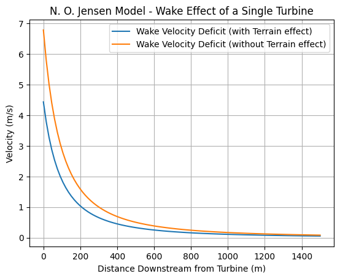
    


#### Multiple Wake Effect on a Wind Farm using Superposition Principle:

##### Implementing Multiple Wake Superposition and Area Overlap modelling methods:


```python
def calc_shadow_coeff(WT1:WindTurbine,WT2:WindTurbine):
    """
    Calculate the area of shadow cast on the area swept by turbine WT2, 
    by the Wake circle of the turbine WT1.

    Returns the fractional portion of WT2 area covered.
    """
    
    # As shadow is only cast by upstream turbine on downstream turbine
    if(WT1.x >= WT2.x):
        return 0
    
    dx_12 = WT2.x - WT1.x

    R = WT1.rotor_D/2 + WT1.alpha * dx_12
    r = WT2.rotor_D/2

    R, r = max(R,r), min(R,r)

    # Considering terrain effect and hub heights
    H1 = WT1.hl_H / (1 + ((WT1.x-WT1.hl_x)/WT1.hl_L)**2)
    H2 = WT2.hl_H / (1 + ((WT2.x-WT2.hl_x)/WT2.hl_L)**2)
    dy_12 = np.sqrt( (WT2.y - WT1.y)**2 + ((WT1.hub_h+H1) - (WT2.hub_h+H2))**2 )


    if(dy_12<=np.abs(R-r)): # Full overlap:
        return 1
    
    if(dy_12>=R+r): # No overlap:
        return 0
    
    # Partial overlap:
    h_center = (R + r + dy_12) / 2
    A_tri = np.sqrt((h_center)*(h_center-R)*(h_center-r)*(h_center-dy_12))

    l = 2 * A_tri / dy_12
    cos_theta = (R**2+r**2-dy_12**2)/(2*R*r)
    if (cos_theta>r/R):
        A_shadow = (R**2)*np.arctan(l/R) + (r**2)*(np.pi - np.arctan(l/r)) - 2*A_tri
    else:
        A_shadow = (R**2)*np.arctan(l/R) + (r**2)*(np.arctan(l/r)) - 2*A_tri
    
    # Return the fraction of total area shadowed:
    return A_shadow / (np.pi*((WT2.rotor_D/2)**2))


def calc_WT_vel_superposition(WT:WindTurbine,turbines):
    """
    Calculates and updates the net velocity experienced by turbine WT, 
    from upstream, owing to the cumulative Wake effect of all 
    upstream Wind Turbines, calculated using momentum-conserved superposition.
    """
    total_deficit = 0
    for wt in turbines:
        if(wt.x>WT.x):
            break
        
        beta = calc_shadow_coeff(wt,WT)

        # Very inefficient implementation
        total_deficit += beta*(WT.V**2 - (WT.V - jensen_model_deficit(wt, WT.x-wt.x)*beta)**2)
        
        # print(f"({WT.x,WT.y}) Shadow_coeff: {beta}")
    
    # Updating the effective velocity of oncoming upstream wind, after superposition of Wake effects.
    WT.V = np.sqrt(WT.V**2 - total_deficit)
    
    return

def calc_point_vel_superposition(V,x,y,turbines):
    """
    Calculate the net wind speed at a point in the plane, 
    due to the cumulative effects of all upstream Wakes.

    Parameters:

    x : float
        The x co-ordinate of the point in plane
    y : float
        The y co-ordinate of the point in plane
    V : float
        The undisturbed wind speed at point.
    turbines : array of WindTurbine elements
        The description of all WT's in the farm
    """
    vel_deficit = 0
    for wt in turbines:
        if(wt.x>x):
            break
        if(np.abs(wt.y - y) <= (wt.rotor_D/2 + wt.alpha*(x - wt.x))):
            # Very inefficient implementation
            vel_deficit += (V**2 - (V - jensen_model_deficit(wt, x-wt.x))**2)
     
    res = np.sqrt(V**2 - vel_deficit)

    return res

```

##### Defining the Power Curve of the Wind Turbine:


```python
def power_out(vel, rated_p=1.8, cut_in_v = 4, cut_out_v = 25, rated_v = 13):
    """
    Returns the power output of a WT (mega watts) given upstream wind speed 'vel' (m/s)
    Default values are chosen of the Vestas V90 1.8 MW Wind Turbine
    """
    return np.where(vel>=cut_in_v ,np.where(vel<rated_v ,rated_p*(vel**3-cut_in_v**3)/(rated_v**3-cut_in_v**3),np.where(vel<=cut_out_v,rated_p,0)),0)
```

##### Defining the Wind Farm layout and Wind Turbine specifications:


```python
# Description of the Wind Farm layout and Turbine specification:

# WT specifications
rotor_D, hub_h, Ct, alpha = 90, 100, 0.3, 0.08

# Wind Farm layout:
V = 8.5
theta = 0
seperation  = 7 * rotor_D
rows = 10
columns = 6

# Initializing WT's according to layout and specifications.
turbines = np.empty(shape=(rows,columns),dtype=np.dtype("object"))
for i in range(rows):
    for j in range(columns):

        # Assigning the position of WT on plane (Grid configuration)
        x_co = seperation*j
        y_co = seperation*i
        
        # # Another configuration (Alternate Shifted Grid)
        # x_co = seperation*j 
        # y_co = seperation*i + seperation*(j%2)/2
        
        turbines[i,j] = WindTurbine(rotor_D,hub_h,Ct,alpha,x_co,y_co,V)

turbines = turbines.T.flatten() # Change the layout of the array from 2D to 1D.
```

##### Defining function for Rotation of Plane and Calculation of Velocity Field:


```python
def rotate_turbine_layout(turbines, theta):
    """
    Rotates the plane of Wind Turbines to align wind direction along +ve x-axis.

    Input:
        'theta': Angle by which plane is rotated w.r.t. +ve x-axis.
        'turbines' : A collection of all Wind Turbines in the farm, each at a particular point in 2D-plane.    
    """
    theta = theta*np.pi/180
    for wt in turbines:
        wt.x, wt.y = (wt.x)*np.cos(theta) - (wt.y)*np.sin(theta) , (wt.x)*np.sin(theta) + (wt.y)*np.cos(theta)

        # Adjust terrain effect:
        wt.hl_x, wt.hl_y = (wt.hl_x)*np.cos(theta) - (wt.hl_y)*np.sin(theta) , (wt.hl_x)*np.sin(theta) + (wt.hl_y)*np.cos(theta)
        wt.hill_coeff() # Set the new coefficients
        wt.V = wt.wind * (1 + 4*wt.hl_a*wt.hl_s) # Update the upstream velocity
    
    return np.asarray(sorted(turbines,key=lambda WT: WT.x))

def WF_vel_distribution(turbines):
    # Calculating the upper and lower limits of the plane:
    y_upper = y_lower = 0
    for wt in turbines:
        if(wt.y<y_lower):
            y_lower = wt.y
        if(wt.y>y_upper):
            y_upper = wt.y
    x_lower = turbines[0].x
    x_upper = turbines[rows*columns - 1].x

    # Defining the plane on which wind velocity field will be calculated.
    x_range = np.linspace(x_lower - 10, x_upper + seperation, 200)
    y_range = np.linspace(y_lower - 3*rotor_D, y_upper + 3*rotor_D, 200)

    # Populating the planar space with wind calculated velocities
    def vel_field(turbines,x_range,y_range):
        dist = np.empty(shape=(x_range.size,y_range.size),dtype=np.dtype("float64"))
        for x_i in range(x_range.size):
            for y_i in range(y_range.size):
                dist[x_i,y_i] = calc_point_vel_superposition(V,x_range[x_i],y_range[y_i], turbines)

        return dist.T
    
    return vel_field(turbines,x_range, y_range)

```

##### Computation of Wake effect and Farm Power Output:


```python
# Test the Wind Farm for different Wind Directions:
velocity_fields = []
wind_angle = []
generated_power = []

step_number = 18
step_angle = 180//step_number

for i in range(step_number):
    # Set the idle wind-velocity faced by each turbine:
    for wt in turbines:
        wt.V = V

    # Calculating Wake effect over the entire Wind Farm:
    for wt in turbines:
        calc_WT_vel_superposition(wt,turbines)

    total_output = 0
    for wt in turbines:
        total_output += power_out(wt.V)

    velocity_fields.append(WF_vel_distribution(turbines))
    wind_angle.append(theta)
    generated_power.append(total_output)

    # Rotating planar frame, to adjust wind direction:
    turbines = rotate_turbine_layout(turbines,-(step_angle)) # Rotation of wind direction along +ve x-axis, hence opposite(-) rotation aligns layout.

    theta = (theta + step_angle)%360

    # for wt in angled_turbines:
    #     print(f"Position:({wt.x},{wt.y}) Velocity: {wt.V} m/s")


```

##### Visualising the Wind Velocity Fields for different Wind Conditions:


```python
def plot_contous(velocity_fields,rotations,power_outs):
    """
    Plot contour plots for each 2D matrix in a given list of velocity_fields.
    The whole figure will have a single colorbar for all plots with uniform color coding based on the minimum and maximum values across all velocity_fields.

    Parameters:
    velocity_fields (list of 2D arrays): A list of 2D velocity_fields (numpy arrays) to be plotted.

    rotations : A list of angles by which the plane is rotated.

    Returns:
    None
    """

    # Calculate the minimum and maximum values across all velocity_fields
    min_val = min(np.min(matrix) for matrix in velocity_fields)
    max_val = max(np.max(matrix) for matrix in velocity_fields)

    num_velocity_fields = len(velocity_fields)
    num_rows = (num_velocity_fields + 2) // 3  # Number of rows in the figure
    num_cols = min(3 , num_velocity_fields)  # Number of columns in the figure

    fig, axes = plt.subplots(num_rows, num_cols, figsize=(15*num_cols, 5*num_rows))

    contour_plots = []  # List to store contour plots for all velocity_fields

    for i, matrix in enumerate(velocity_fields):
        if num_velocity_fields > 1:
            ax = axes[i // num_cols, i % num_cols]
        else:
            ax = axes  # For a single matrix, use the same axis

        # Create a contour plot for the current matrix with uniform color coding
        contour = ax.contourf(matrix, levels=np.linspace(min_val, max_val, 200))

        # Set plot title and labels
        ax.set_title(f"Wind Angle: {rotations[i]}°   Farm Output: {'{:.3f}'.format(power_outs[i])} MW ",fontsize=20)
        # ax.set_xlabel("X-axis")
        # ax.set_ylabel("Y-axis")

        # Remove x and y ticks
        ax.set_xticks([])
        ax.set_yticks([])
    
        contour_plots.append(contour)

    # Get the maximum number of contour levels among all plots for the colorbar
    # num_levels = max(len(c.levels) for c in contour_plots)

    # Create a single horizontal colorbar for all contour plots with the same number of levels
    cbar = fig.colorbar(contour_plots[0], ax=axes, ticks=np.linspace(min_val, max_val, 10), orientation='vertical',aspect=30)

    # Set the fontsize of the color bar labels
    cbar.ax.tick_params(labelsize=20)

    # Add a title for the entire figure
    # plt.suptitle("Directed Wind Velocity Distributions", fontsize=16)
    
    plt.show()

# Display the results:
plot_contous(velocity_fields,wind_angle,generated_power)
```


    
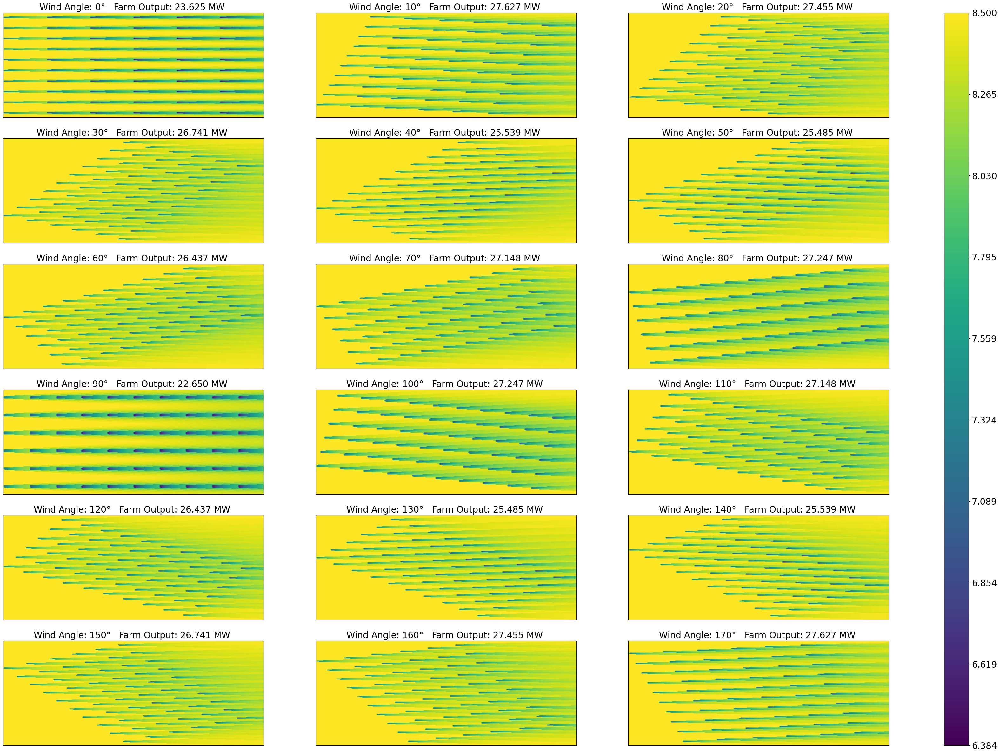
    


### Study of the Power Curve of a Wind Turbine Generation Characteristics

#### Power output calculations and characteristic curves:

##### Importing and organising the Wind and Power Output data:


```python
path = ".\wind_data.txt"

windpower_data = pd.read_csv(path,sep='\t')
windpower_data.head()
```


<div>
<style scoped>
    .dataframe tbody tr th:only-of-type {
        vertical-align: middle;
    }

    .dataframe tbody tr th {
        vertical-align: top;
    }

    .dataframe thead th {
        text-align: right;
    }
</style>
<table border="1" class="dataframe">
  <thead>
    <tr style="text-align: right;">
      <th></th>
      <th>Date(YYYY-MM-DD hh:mm:ss)</th>
      <th>W</th>
      <th>P</th>
    </tr>
  </thead>
  <tbody>
    <tr>
      <th>0</th>
      <td>01-01-2006 00:00</td>
      <td>5.12</td>
      <td>1.788</td>
    </tr>
    <tr>
      <th>1</th>
      <td>01-01-2006 00:10</td>
      <td>5.12</td>
      <td>1.788</td>
    </tr>
    <tr>
      <th>2</th>
      <td>01-01-2006 00:20</td>
      <td>5.14</td>
      <td>1.812</td>
    </tr>
    <tr>
      <th>3</th>
      <td>01-01-2006 00:30</td>
      <td>5.17</td>
      <td>1.848</td>
    </tr>
    <tr>
      <th>4</th>
      <td>01-01-2006 00:40</td>
      <td>5.24</td>
      <td>1.929</td>
    </tr>
  </tbody>
</table>
</div>


```python
windpower_data.info()
```

    <class 'pandas.core.frame.DataFrame'>
    RangeIndex: 52560 entries, 0 to 52559
    Data columns (total 3 columns):
     #   Column                     Non-Null Count  Dtype  
    ---  ------                     --------------  -----  
     0   Date(YYYY-MM-DD hh:mm:ss)  52560 non-null  object 
     1   W                          52560 non-null  float64
     2   P                          52560 non-null  float64
    dtypes: float64(2), object(1)
    memory usage: 1.2+ MB
    


```python
date_format = "%d-%m-%Y %H:%M"
windpower_data["Date(YYYY-MM-DD hh:mm:ss)"] = pd.to_datetime(windpower_data["Date(YYYY-MM-DD hh:mm:ss)"],format=date_format)
# windpower_data["P"] = windpower_data["P"] / 100 # Converting to MW
```


```python
windpower_data.set_index("Date(YYYY-MM-DD hh:mm:ss)",inplace=True)
windpower_data.rename_axis(index=[None, ],inplace=True)
windpower_data.rename(columns={"W":"Wind Speed (m/s)", "P":"Actual Power Output", },inplace=True)
```


```python
windpower_data.head()
```


<div>
<style scoped>
    .dataframe tbody tr th:only-of-type {
        vertical-align: middle;
    }

    .dataframe tbody tr th {
        vertical-align: top;
    }

    .dataframe thead th {
        text-align: right;
    }
</style>
<table border="1" class="dataframe">
  <thead>
    <tr style="text-align: right;">
      <th></th>
      <th>Wind Speed (m/s)</th>
      <th>Actual Power Output</th>
    </tr>
  </thead>
  <tbody>
    <tr>
      <th>2006-01-01 00:00:00</th>
      <td>5.12</td>
      <td>1.788</td>
    </tr>
    <tr>
      <th>2006-01-01 00:10:00</th>
      <td>5.12</td>
      <td>1.788</td>
    </tr>
    <tr>
      <th>2006-01-01 00:20:00</th>
      <td>5.14</td>
      <td>1.812</td>
    </tr>
    <tr>
      <th>2006-01-01 00:30:00</th>
      <td>5.17</td>
      <td>1.848</td>
    </tr>
    <tr>
      <th>2006-01-01 00:40:00</th>
      <td>5.24</td>
      <td>1.929</td>
    </tr>
  </tbody>
</table>
</div>


##### Using the previously defined Power Curve to Calculate Output:


```python
# Calculating the theoretical power output at different wind speeds:
windpower_data["Theoretical Power Output (MW)"] = power_out(windpower_data["Wind Speed (m/s)"])
windpower_data.head()
```


<div>
<style scoped>
    .dataframe tbody tr th:only-of-type {
        vertical-align: middle;
    }

    .dataframe tbody tr th {
        vertical-align: top;
    }

    .dataframe thead th {
        text-align: right;
    }
</style>
<table border="1" class="dataframe">
  <thead>
    <tr style="text-align: right;">
      <th></th>
      <th>Wind Speed (m/s)</th>
      <th>Actual Power Output</th>
      <th>Theoretical Power Output (MW)</th>
    </tr>
  </thead>
  <tbody>
    <tr>
      <th>2006-01-01 00:00:00</th>
      <td>5.12</td>
      <td>1.788</td>
      <td>0.059255</td>
    </tr>
    <tr>
      <th>2006-01-01 00:10:00</th>
      <td>5.12</td>
      <td>1.788</td>
      <td>0.059255</td>
    </tr>
    <tr>
      <th>2006-01-01 00:20:00</th>
      <td>5.14</td>
      <td>1.812</td>
      <td>0.060588</td>
    </tr>
    <tr>
      <th>2006-01-01 00:30:00</th>
      <td>5.17</td>
      <td>1.848</td>
      <td>0.062606</td>
    </tr>
    <tr>
      <th>2006-01-01 00:40:00</th>
      <td>5.24</td>
      <td>1.929</td>
      <td>0.067407</td>
    </tr>
  </tbody>
</table>
</div>


##### Visualising the Offshore Wind Speed data:


```python
# The wind speed data over a period of time visualised:
plt.figure(figsize=(12, 6))

start_date = '2006-11-06 00:00'
end_date = '2006-11-07 00:00'
data_subinterval = windpower_data.loc[start_date:end_date]

# plt.plot(data_subinterval.index, data_subinterval['P'], marker='.', linestyle='-')
plt.plot(data_subinterval.index, data_subinterval['Wind Speed (m/s)'])

plt.xlabel('Date')
plt.ylabel('Wind Speed (m/s)')
plt.title('Time Series Data for Sub-Interval')
plt.grid(True)
plt.xticks(rotation=45)
plt.tight_layout()
plt.show()
```


    
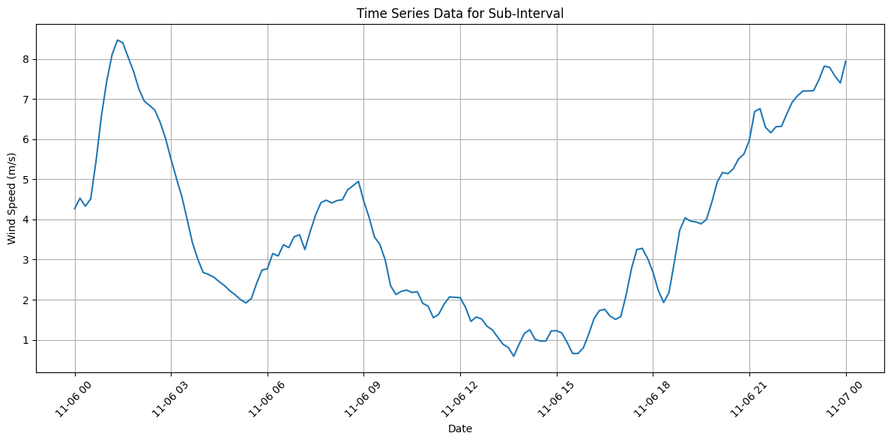
    


##### Visualising the Power Curves from given Wind Speed data:


```python
# The Power Curve (Output Power v.s. Wind Speed characteristics)

fig, axs = plt.subplots(nrows=1,ncols=2,figsize=(15,6),layout="constrained")

sns.scatterplot(windpower_data,x="Wind Speed (m/s)",y="Actual Power Output",hue="Wind Speed (m/s)",palette=sns.color_palette("viridis",as_cmap=True),ax=axs[0])

axs[0].grid()
axs[0].set_ylabel('Actual Output Power')
axs[0].set_xlabel('Wind Speed (m/s)')
# axs[0].set_facecolor("grey")
axs[0].set_title('Power Curve of an Offshore Wind Turbine')

sns.scatterplot(windpower_data,x="Wind Speed (m/s)",y="Theoretical Power Output (MW)",hue="Wind Speed (m/s)",palette=sns.color_palette("viridis",as_cmap=True),ax=axs[1])

axs[1].grid()
axs[1].set_ylabel('Theoretical Output Power (MW)')
axs[1].set_xlabel('Wind Speed (m/s)')
# axs[1].set_facecolor("grey")
axs[1].set_title('Power Curve of the Vestas V90 1.8MW Wind Turbine')

plt.show()
```


    
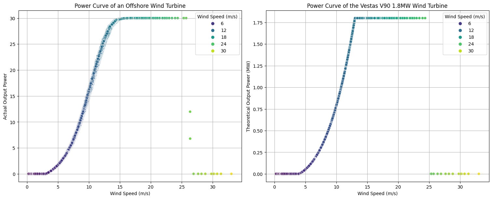
    


##### Visualising the Variation of Farm Output with Wind Direction:


```python
deg_res = 0.8
output_curve = []

# theta = 0
for i in range(int(360/deg_res)):
    # Set the idle wind-velocity faced by each turbine:
    for wt in turbines:
        wt.V = V

    # Calculating Wake effect over the entire Wind Farm:
    for wt in turbines:
        calc_WT_vel_superposition(wt,turbines)    

    total_output = 0
    for wt in turbines:
        total_output += power_out(wt.V)

    output_curve.append([theta, total_output])

    # Rotating planar frame, to adjust wind direction:
    turbines = rotate_turbine_layout(turbines,-(deg_res)) # Rotation of wind direction along +ve x-axis, hence opposite(-) rotation aligns layout.

    theta = (theta + deg_res)%360

output_curve.sort(key=lambda x: x[0])
output_curve = np.asarray(output_curve).T

avg_farm_out = np.sum(output_curve[1]) / output_curve.shape[1]
```


```python
def plot_points(x_coords, y_coords, line=True,marks=False,avg_farm_out = 0):
    """
    Plot a list of points on a 2D coordinate plane.

    Parameters:
    'x_coords' and 'y_coords' : Arrays which together describe each point in 2D plane.

    """
    plt.figure(figsize=(15,8))

    # Create the plot with scatter points
    if(line and marks):
        plt.plot(x_coords, y_coords, color='red', marker='.', linestyle='-', linewidth=1)
    elif(line):
        plt.plot(x_coords, y_coords, color='red', linestyle='-', linewidth=1)
    else:
        plt.plot(x_coords, y_coords, color='red', marker='.', linestyle='')

    plt.xlabel("Wind Angle (°)")
    plt.ylabel("Farm Output Power (MW)")
    plt.title(f"Variation in Farm Output with Wind Direction (Average Farm Output Power: {avg_farm_out} MW)")
    plt.grid(True)

    # Show the plot
    plt.show()

plot_points(output_curve[0],output_curve[1],line=True,marks=False,avg_farm_out=avg_farm_out)
```


    
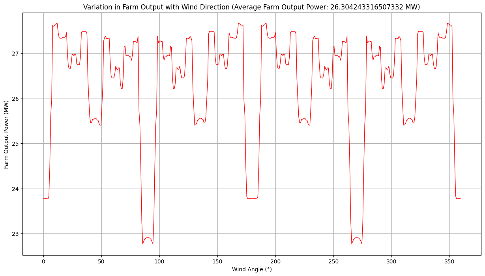
    


##### Power Curve of the Vestas V90 2MW Wind Turbine:


```python
path = "./Vestas 2MW WT.txt"
vestas_2mw_data = pd.read_csv(path,sep=' ',index_col=0)

# Removing the 'index' title:
vestas_2mw_data.rename_axis(index=None,inplace=True)

# Sorting the columns:
vestas_2mw_data.rename(lambda x: float(x),axis="columns",inplace=True)
vestas_2mw_data.sort_index(axis="columns",inplace=True)

vestas_2mw_data.head()
```


<div>
<style scoped>
    .dataframe tbody tr th:only-of-type {
        vertical-align: middle;
    }

    .dataframe tbody tr th {
        vertical-align: top;
    }

    .dataframe thead th {
        text-align: right;
    }
</style>
<table border="1" class="dataframe">
  <thead>
    <tr style="text-align: right;">
      <th></th>
      <th>0.950</th>
      <th>0.975</th>
      <th>1.000</th>
      <th>1.025</th>
      <th>1.050</th>
      <th>1.075</th>
      <th>1.100</th>
      <th>1.125</th>
      <th>1.150</th>
      <th>1.175</th>
      <th>1.200</th>
      <th>1.225</th>
      <th>1.250</th>
      <th>1.275</th>
    </tr>
  </thead>
  <tbody>
    <tr>
      <th>4.0</th>
      <td>63</td>
      <td>66</td>
      <td>68</td>
      <td>70</td>
      <td>73</td>
      <td>75</td>
      <td>78</td>
      <td>80</td>
      <td>82</td>
      <td>85</td>
      <td>87</td>
      <td>89</td>
      <td>92</td>
      <td>94</td>
    </tr>
    <tr>
      <th>4.5</th>
      <td>105</td>
      <td>108</td>
      <td>112</td>
      <td>115</td>
      <td>119</td>
      <td>122</td>
      <td>125</td>
      <td>129</td>
      <td>132</td>
      <td>136</td>
      <td>139</td>
      <td>142</td>
      <td>146</td>
      <td>149</td>
    </tr>
    <tr>
      <th>5.0</th>
      <td>154</td>
      <td>158</td>
      <td>163</td>
      <td>167</td>
      <td>172</td>
      <td>177</td>
      <td>181</td>
      <td>186</td>
      <td>191</td>
      <td>195</td>
      <td>200</td>
      <td>204</td>
      <td>209</td>
      <td>213</td>
    </tr>
    <tr>
      <th>5.5</th>
      <td>211</td>
      <td>217</td>
      <td>224</td>
      <td>230</td>
      <td>236</td>
      <td>242</td>
      <td>248</td>
      <td>254</td>
      <td>260</td>
      <td>266</td>
      <td>272</td>
      <td>279</td>
      <td>285</td>
      <td>291</td>
    </tr>
    <tr>
      <th>6.0</th>
      <td>280</td>
      <td>288</td>
      <td>296</td>
      <td>304</td>
      <td>312</td>
      <td>320</td>
      <td>328</td>
      <td>336</td>
      <td>344</td>
      <td>352</td>
      <td>360</td>
      <td>368</td>
      <td>376</td>
      <td>383</td>
    </tr>
  </tbody>
</table>
</div>


```python
# Extracting the column and index labels:
dens = vestas_2mw_data.columns.values
spds = vestas_2mw_data.index.values

# Processing the data:
modified_2mw_data = pd.DataFrame(np.asarray([np.tile(dens,vestas_2mw_data.shape[0]), np.tile(spds,(vestas_2mw_data.shape[1],1)).T.flatten(), vestas_2mw_data.values.flatten()]),index=["Air Density (S.I)", "Wind Speed (S.I)", "Output Power (kW)"])
modified_2mw_data.head()
```


<div>
<style scoped>
    .dataframe tbody tr th:only-of-type {
        vertical-align: middle;
    }

    .dataframe tbody tr th {
        vertical-align: top;
    }

    .dataframe thead th {
        text-align: right;
    }
</style>
<table border="1" class="dataframe">
  <thead>
    <tr style="text-align: right;">
      <th></th>
      <th>0</th>
      <th>1</th>
      <th>2</th>
      <th>3</th>
      <th>4</th>
      <th>5</th>
      <th>6</th>
      <th>7</th>
      <th>8</th>
      <th>9</th>
      <th>...</th>
      <th>256</th>
      <th>257</th>
      <th>258</th>
      <th>259</th>
      <th>260</th>
      <th>261</th>
      <th>262</th>
      <th>263</th>
      <th>264</th>
      <th>265</th>
    </tr>
  </thead>
  <tbody>
    <tr>
      <th>Air Density (S.I)</th>
      <td>0.95</td>
      <td>0.975</td>
      <td>1.0</td>
      <td>1.025</td>
      <td>1.05</td>
      <td>1.075</td>
      <td>1.1</td>
      <td>1.125</td>
      <td>1.15</td>
      <td>1.175</td>
      <td>...</td>
      <td>1.05</td>
      <td>1.075</td>
      <td>1.1</td>
      <td>1.125</td>
      <td>1.15</td>
      <td>1.175</td>
      <td>1.2</td>
      <td>1.225</td>
      <td>1.25</td>
      <td>1.275</td>
    </tr>
    <tr>
      <th>Wind Speed (S.I)</th>
      <td>4.00</td>
      <td>4.000</td>
      <td>4.0</td>
      <td>4.000</td>
      <td>4.00</td>
      <td>4.000</td>
      <td>4.0</td>
      <td>4.000</td>
      <td>4.00</td>
      <td>4.000</td>
      <td>...</td>
      <td>13.00</td>
      <td>13.000</td>
      <td>13.0</td>
      <td>13.000</td>
      <td>13.00</td>
      <td>13.000</td>
      <td>13.0</td>
      <td>13.000</td>
      <td>13.00</td>
      <td>13.000</td>
    </tr>
    <tr>
      <th>Output Power (kW)</th>
      <td>63.00</td>
      <td>66.000</td>
      <td>68.0</td>
      <td>70.000</td>
      <td>73.00</td>
      <td>75.000</td>
      <td>78.0</td>
      <td>80.000</td>
      <td>82.00</td>
      <td>85.000</td>
      <td>...</td>
      <td>1978.00</td>
      <td>1982.000</td>
      <td>1986.0</td>
      <td>1990.000</td>
      <td>1994.00</td>
      <td>1996.000</td>
      <td>1997.0</td>
      <td>1998.000</td>
      <td>1999.00</td>
      <td>1999.000</td>
    </tr>
  </tbody>
</table>
<p>3 rows × 266 columns</p>
</div>


#### Modelling the Power Curve of the Vestas V90 2MW Turbine:

##### The Polynomial Feature Transform:


```python
def polynomial_transform(features:np.ndarray, degree, p_table, pos = 0, res=1):
    """
    Takes a set of 'features', and extracts the polynomial transform of features upto given 'degree'.

    Input:
        features: An ndarray of feature values, which are to be transformed.

        degree: The degree of the polynomial with given 'features' as factors.

    """
    if(pos==features.shape[0] or degree==0):
        # print("Result:",res)
        p_table.append(np.copy(res))
        return p_table

    p = np.ones((features.shape[1], ))*res
    for i in range(degree+1):
        polynomial_transform(features,degree-i,p_table,pos+1,p)
        p *= features[pos]

    return p_table
    
```

##### A 2-variable Polynomial Model considering variable 'Wind Speed' and 'Air density':  


```python
# Feature Engineering: (Polynomial Transform degree-6 with 2-features)
X_train = []
X_train = np.asarray(polynomial_transform(modified_2mw_data.loc[['Air Density (S.I)','Wind Speed (S.I)'],:].values,6,X_train))

# Extracting Data Point Labels:
Y_train = modified_2mw_data.loc["Output Power (kW)",:].values.reshape(1, modified_2mw_data.shape[1])
```


```python
# Defining the model: (degree-6 features-2)
deg6_2mw_polynomial_model = NN(1,[X_train.shape[0], 1, ],["None", ], losses.mse_loss,losses.mse_loss_deriv,AdaM_opt=True)
```


```python
# Hyperparameter tuning:
deg6_2mw_polynomial_model.alpha = 0.0000006

deg6_2mw_polynomial_model.reglr_type = "L1"
deg6_2mw_polynomial_model.lmbd = 0

# To counter-act a bug in code:
deg6_2mw_polynomial_model.frwrd_trials = 10000
deg6_2mw_polynomial_model.back_trials = 10000

# Training:
total_trials = 100001
for trial in range(total_trials):
    train_loss = (NN.training_cycle(deg6_2mw_polynomial_model, X=X_train, Y=Y_train))
    if((trial)%100==0):
        print("Trial number:",trial)
        print("The total training accuracy: ",train_loss)
        print("---------------------------------------------------------------------------------------------------")
```


```python
pow_vals = []

v_range = np.linspace(3.5,13.5,100)
dens_range = np.linspace(.9, 1.3,100)

X, Y = np.meshgrid(v_range, dens_range)

dv = (13-4)/300
for v in v_range:
    part = []
    for d in dens_range:
        t = []
        part.append(deg6_2mw_polynomial_model.predict(polynomial_transform(np.array([d,v],ndmin=2).T,6,t))[0,0])
    pow_vals.append(part)

Z = np.asarray(pow_vals)

```


```python
fig = plt.figure(figsize=(10, 8))
ax = plt.axes(projection='3d')

ax.plot_surface(X, Y, Z, cmap='viridis', alpha=1)
ax.view_init(30, 10)
plt.show()
```


    
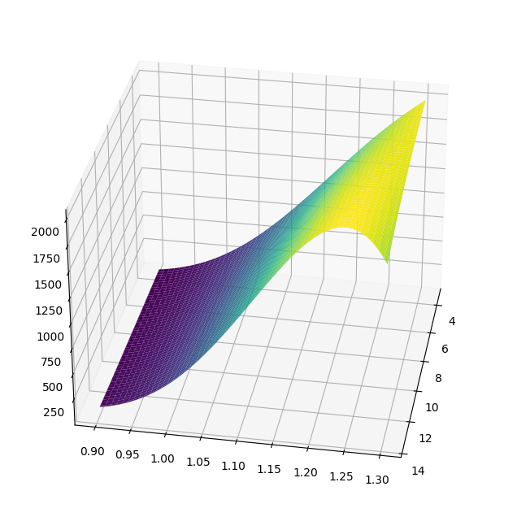
    


##### A Polynomial Model of the Power Output v.s. Wind Speed curve at constant Air density (1.225 kg/m3) : 


```python
power_out_data = vestas_2mw_data.loc[:,1.225]

X_train = []
X_train = np.asarray(polynomial_transform(power_out_data.index.values.reshape(1, power_out_data.size), 5, X_train))

Y_train = power_out_data.values.reshape(1, power_out_data.size)

vestas_2mw_std_model = NN(1,[X_train.shape[0], 1], ["None", ], losses.mse_loss, losses.mse_loss_deriv,AdaM_opt=True)
```


```python
# Hyperparameter tuning:
vestas_2mw_std_model.reglr_type = "L1"
vestas_2mw_std_model.lmbd = 0

# vestas_2mw_std_model.frwrd_trials = 10000
# vestas_2mw_std_model.back_trials = 10000

# Manipulating curve manually:
# vestas_2mw_std_model.b_layers[1][0,0] += 1

# Training:
total_trials = 100001
batch_size = X_train.shape[1] // 1

for trial in range(total_trials):

    # Hyperparameter tuning:
    # vestas_2mw_std_model.alpha = 0.0001
    vestas_2mw_std_model.alpha = (1 / (trial+1))

    # Stochastic GD 'mask' :
    mask = np.random.choice(X_train.shape[1], batch_size, replace=False)

    train_loss = (NN.training_cycle(vestas_2mw_std_model, X=X_train[:,mask], Y=Y_train[:,mask]))
    if((trial)%500==0):
        print("Trial number:",trial)
        print("The total training accuracy: ",train_loss)
        print("---------------------------------------------------------------------------------------------------")
```


```python
plot_curve = []
v = 4
dv = (13-4)/300

vestas_2mw_power_out = lambda v: (vestas_2mw_std_model.predict(polynomial_transform(np.array(v,ndmin=2),5,[]))[0,0])
for i in range(300):
    plot_curve.append(vestas_2mw_power_out(v))
    v = v + dv

# plt.plot(power_out_data)
plt.plot(plot_curve)
```


    [<matplotlib.lines.Line2D at 0x223577ca9a0>]


    
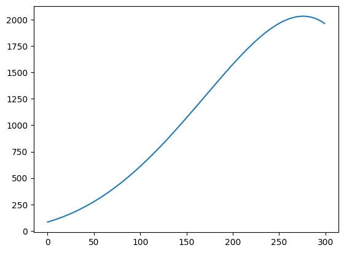
    


##### A 1 layer NN model with 'tanh' activation to fit the Power Curve:


```python
power_out_data = vestas_2mw_data.loc[:,1.225]

X_train = power_out_data.index.values.reshape(1, power_out_data.size)

Y_train = power_out_data.values.reshape(1, power_out_data.size)

tanh_2mw_model = NN(2,[1, 6, 1], ["tanh", "None", ], losses.mse_loss, losses.mse_loss_deriv,AdaM_opt=True)
```


```python
# Hyperparameter tuning:
tanh_2mw_model.reglr_type = "L1"
tanh_2mw_model.lmbd = 0

# tanh_2mw_model.dropout_probs[1, 0] = 1

tanh_2mw_model.frwrd_trials = 10000
tanh_2mw_model.back_trials = 10000

# Training:
total_trials = 100001
batch_size = X_train.shape[1] // 1

for trial in range(total_trials):

    # Hyperparameter tuning:
    tanh_2mw_model.alpha = 0.0001

    # Stochastic GD 'mask' :
    mask = np.random.choice(X_train.shape[1], batch_size, replace=False)

    train_loss = (NN.training_cycle(tanh_2mw_model, X=X_train[:,mask], Y=Y_train[:,mask]))[0]
    if((trial)%1000==0):
        print("Trial number:",trial)
        print("The total training loss: ",train_loss)
        print("---------------------------------------------------------------------------------------------------")
```


```python
plot_curve = []
v = 0
dv = (30-0)/300

tanh_2mw_power_out = lambda v: np.where(v<4,0,np.where(v<=13.5,(tanh_2mw_model.predict(v)[0,0]),np.where(v<=25,2000,0)))/1000
for i in range(300):
    plot_curve.append(tanh_2mw_power_out(v))
    v = v + dv

# plt.plot(power_out_data)
plt.plot(plot_curve)
```


    [<matplotlib.lines.Line2D at 0x14c17152910>]


    
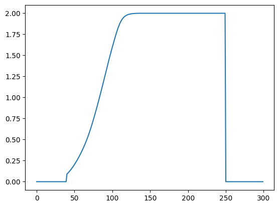
    


##### Testing the model on a 80 WT Farm having Horns Rev 1 layout with given Wind Speed data:


```python
# Description of the Wind Farm layout and Turbine specification:

# WT specifications
rotor_D, hub_h, Ct, alpha = 90, 100, 0.3, 0.08

# Wind Farm layout:
theta = 0
seperation  = 7 * rotor_D
rows = 8
columns = 10

# Wind velocities:
start_date = '2006-01-01 00:00'
end_date = '2007-01-01 00:00'
yr_vels = windpower_data.loc[start_date:end_date]["Wind Speed (m/s)"]

# Initializing WT's according to layout and specifications.
turbines = np.empty(shape=(rows,columns),dtype=np.dtype("object"))
for i in range(rows):
    for j in range(columns):

        # Assigning the position of WT on plane (Grid configuration)
        x_co = seperation*j
        y_co = seperation*i
        
        # # Another configuration (Alternate Shifted Grid)
        # x_co = seperation*j 
        # y_co = seperation*i + seperation*(j%2)/2
        
        turbines[i,j] = WindTurbine(rotor_D,hub_h,Ct,alpha,x_co,y_co,0)

turbines = turbines.T.flatten() # Change the layout of the array from 2D to 1D.

power_table = {}
avg_power_yr = 0

power_table_no_wake = {}
avg_power_yr_no_wake = 0

# timer = 0
for V in yr_vels:

    # timer += 1
    # print(timer/yr_vels.size*100,"%")

    if(power_table_no_wake.get(V,None)==None):
        power_table_no_wake[V] = 0
        for wt in turbines:
            power_table_no_wake[V] += tanh_2mw_power_out(V)

    avg_power_yr_no_wake += power_table_no_wake[V]

    if(power_table.get(V,None)!=None):
        avg_power_yr += power_table[V]
        continue

    for wt in turbines:
        wt.V = V
    
    for wt in turbines:
        calc_WT_vel_superposition(wt,turbines)
    
    power = 0
    for wt in turbines:
        power += tanh_2mw_power_out(wt.V)

    power_table[V] = power
    avg_power_yr += power_table[V]

avg_power_yr = avg_power_yr / yr_vels.size
avg_power_yr_no_wake = avg_power_yr_no_wake / yr_vels.size

print("Average Wind Velocity:",np.mean(yr_vels),"m/s")
print("Average Farm Output Power (With Wake Effect)",avg_power_yr,"MW")
print("Average Farm Output Power (Without Wake Effect)",avg_power_yr_no_wake,"MW")
```

    Average Wind Velocity: 7.792312785388127 m/s
    Average Farm Output Power (With Wake Effect) 64.32824124705796 MW
    Average Farm Output Power (Without Wake Effect) 71.65905021010194 MW
    

### Study of Fatigue Damage in Wind Turbines

##### Defining Pre-processing techniques : (Hysteresis filtering, Peak-Valley Filtering, Binning)


```python
def hysteresis_filtering(load_spectra, band_width = 1):
    if(len(load_spectra)==0):
        return load_spectra
    
    final_spectra = []
    level = load_spectra[0]

    for i in range(len(load_spectra)):
        if(abs(load_spectra[i] - level) >= band_width):
            level = load_spectra[i]
        final_spectra.append(level)
    
    return final_spectra

def binning_data(load_spectra, bin_count = 29):
    bin_base = min(load_spectra)
    bin_width = (max(load_spectra) + 1 - bin_base) / bin_count # '+1' to avoid singular peak.
    
    if(bin_width==0):
        return load_spectra.copy()
    
    final_spectra = []
    for i in range(len(load_spectra)):
        final_spectra.append(int((load_spectra[i]-bin_base) // bin_width))

    return (final_spectra, bin_width, bin_base)

# Doubt: Should inflection points other than peaks and valleys not be removed?
def peak_valley_filtering(load_spectra):
    if(len(load_spectra)<=1):
        return load_spectra.copy()
    
    final_spectra = [load_spectra[0], load_spectra[1]]
    for i in range(2,len(load_spectra)):
        flag = final_spectra[-1]-final_spectra[-2]
        if(flag>0):
            if(load_spectra[i]<final_spectra[-1]):
                final_spectra.append(load_spectra[i])
            else:
                final_spectra[-1] = load_spectra[i]
        elif(flag<0):
            if(load_spectra[i]>final_spectra[-1]):
                final_spectra.append(load_spectra[i])
            else:
                final_spectra[-1] = load_spectra[i]
        else:
            final_spectra[-1] = load_spectra[i]

    return final_spectra

```

##### Defining the Rainflow Counting Algorithm and 'S-N' Curve


```python
def SN_curve(p_range, m = -5.76, k = 3.24, Su = 390):
    # 'S' being the stress-range of the cycle in mega pascals(MPa).(Not normalized)
    # log(p_range) = log(c) + (1/m)*log(N) ;
    # N = (p_range/c)**m ;
    
    if(p_range==0):
        return np.inf
    
    return (p_range/(k*Su))**m


class linked_list(object):
    def __init__(self,value,next=None,prev=None) -> None:
        self.val = value
        self.nxt = next
        self.prv = prev
    
    def insert(self,value):
        if(self==None):
            return linked_list(value)
        
        x = linked_list(value,self.nxt,self)
        
        if(self.nxt!=None):
            self.nxt.prv = x
        self.nxt = x
        
        return x
    
    def delete(self):
        if(self==None):
            return None
        
        if(self.nxt!=None):
            self.nxt.prv = self.prv
        if(self.prv!=None):
            self.prv.nxt = self.nxt

        r = (self.prv) if (self.prv!=None and self.nxt==None) else (self.nxt)
        del self

        return r

def rainflow_counting(data,bins):
    rainflow_matrix = [[0 for i in range(bins)] for h in range(bins)]

    # damage_history[i][0] denotes stress-range, while damage_history[i][1] denotes stress-mean 
    # of a full cycle encountered in the load history.
    damage_history = [(0,0)]

    start = end = linked_list(data[0])
    d_ptr = 1

    while(d_ptr<len(data)):
        if(start==end or start.nxt==end or start.nxt.nxt==end):
            end = end.insert(data[d_ptr])
            d_ptr += 1

        while not (start==end or start.nxt==end or start.nxt.nxt==end):
            o1 = start.val
            i1 = start.nxt.val
            i2 = start.nxt.nxt.val
            o2 = start.nxt.nxt.nxt.val
            
            flag = True
            if(o1>o2):
                o1,o2 = o2,o1
            if(i1>i2):
                i1,i2 = i2,i1
                flag = False

            if(o1<=i1 and o2>=i2):
                if(flag):
                    rainflow_matrix[i1][i2] += 1
                else:
                    rainflow_matrix[i2][i1] += 1
                
                damage_history.append(((i2-i1), (i2+i1)//2))

                start.nxt.nxt.delete()
                start.nxt.delete()
            
                if(start.prv!=None):
                    start = start.prv
                if(start.prv!=None):
                    start = start.prv
            else:
                start = start.nxt
                damage_history.append((0,0))

    residue = []
    while(end!=None):
        residue.append(end.val)
        end = end.delete()
    
    for i in range(len(residue)//2):
        residue[i], residue[len(residue)-1-i] = residue[len(residue)-1-i], residue[i]
    
    return rainflow_matrix, damage_history, residue
```

##### Verification of the model and some results


```python
sig, mu = 89, 0
data = np.random.randn(15000)*sig + mu

bins = 101
hyst_noise_band = 0

processed_data, bin_width, base_value = binning_data(peak_valley_filtering(hysteresis_filtering(data,hyst_noise_band)),bins)
processed_data = peak_valley_filtering(processed_data)

print("Bin Width =",bin_width,"; Base Value =",base_value)

plt.figure(figsize=(17,6))
plt.plot(processed_data)
plt.show()
```

    Bin Width = 7.0237179939266445 ; Base Value = -346.489231948206
    


    
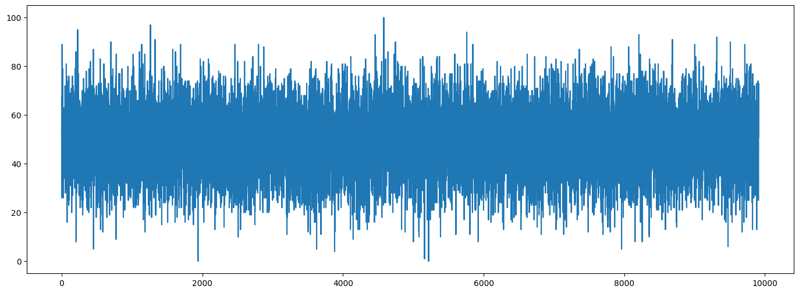
    


```python
rf_matrix, history, residue = rainflow_counting(processed_data,bins)

plt.plot(residue)
plt.show()
```


    
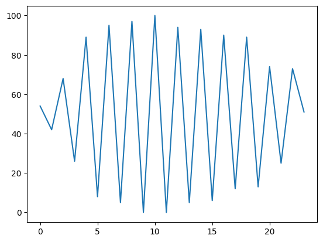
    


```python
fatigue_dmg = [0]
for dat in history:
    fatigue_dmg.append(fatigue_dmg[-1] + (1 / SN_curve(dat[0]*bin_width)) )

plt.plot(fatigue_dmg)
plt.show()
```


    
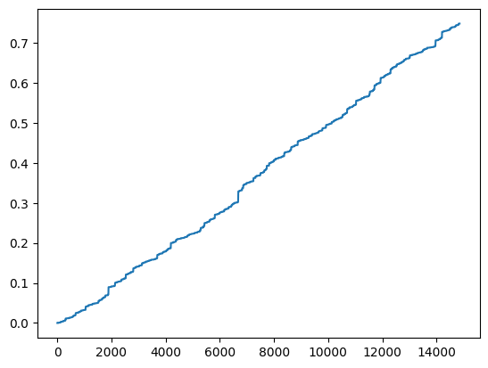
    


```python
sns.heatmap(rf_matrix,linewidth=0)
plt.show()
```


    
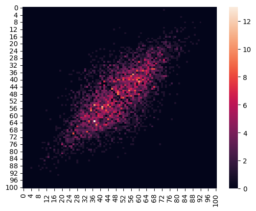
    


```python

```
